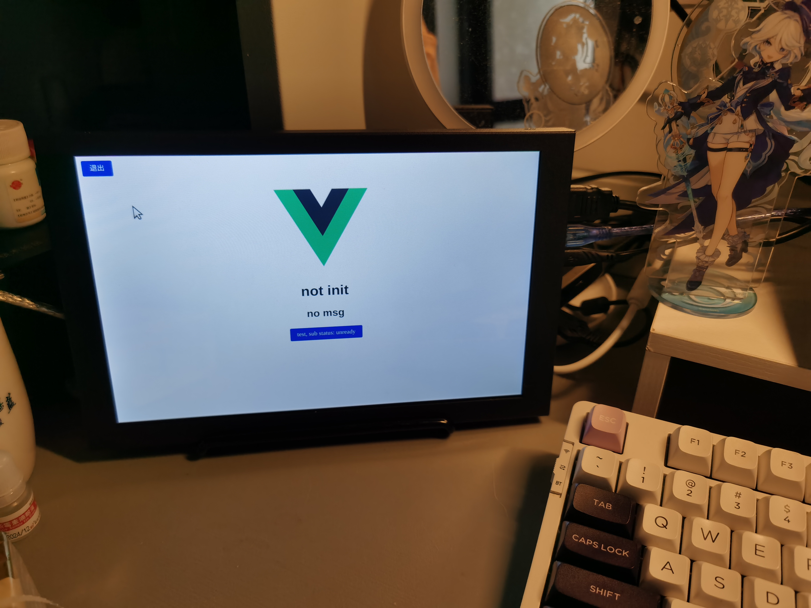

# ROS + Electron + Vue + TDesign DEMO



## 使用方法

- 安装依赖

```shell
npm install
```

- 启动 ROS Bridge (ROS 1)

```shell
roslaunch rosbridge_server rosbridge_websocket.launch
```

- 网页模式

```shell
npm run serve
```

- Electron桌面应用模式

```shell
# background.js:32修改为 preload: path.join(__dirname, 'src/preload.js')
npm run electron:serve
```

- 构建amd64和Arm64的AppImage

```shell
# background.js:32修改为 preload: path.join(process.resourcesPath, 'src/preload.js')
npm run electron:build
```

## 测试

`example`文件夹是已经构建好的两个包,直接运行即可

默认监听`/xf_iat_result`的topic

```shell
rostopic pub /xf_iat_result std_msgs/String "data: '发布测试文本'"
```